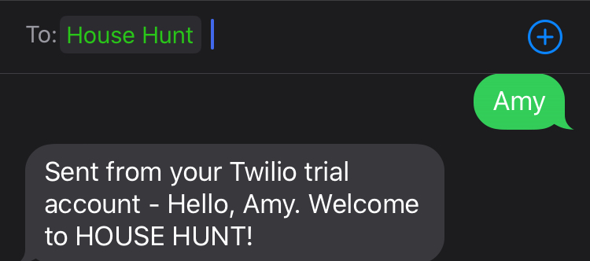
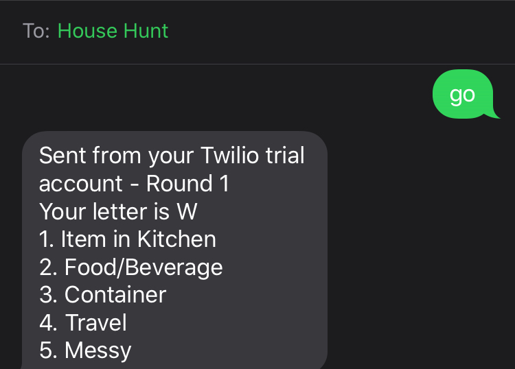
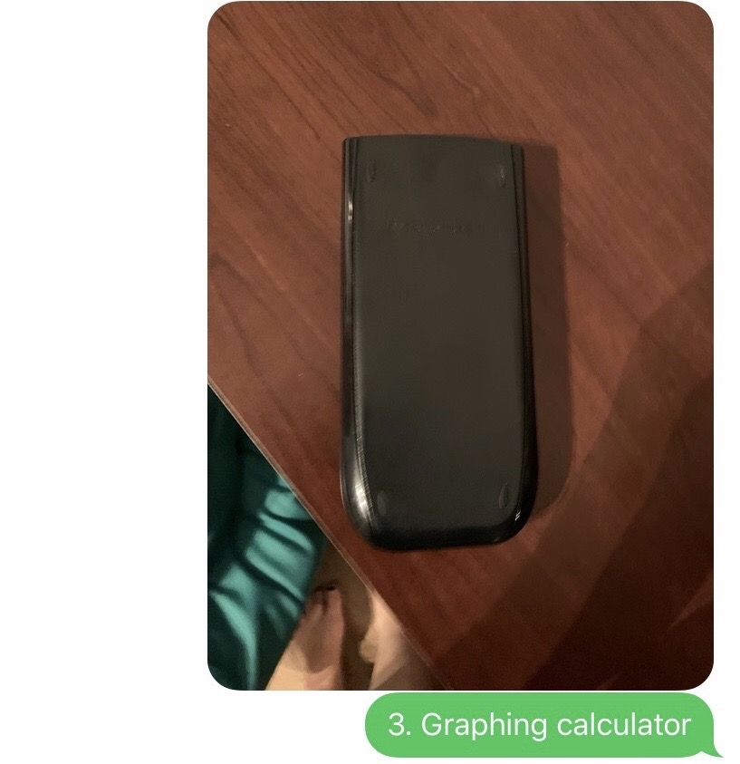
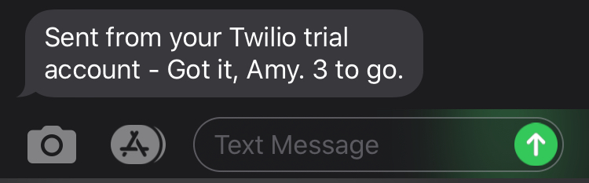
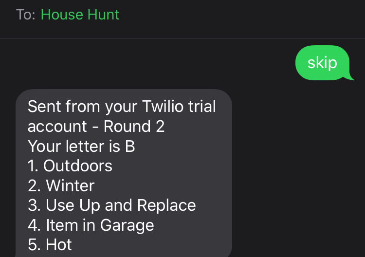
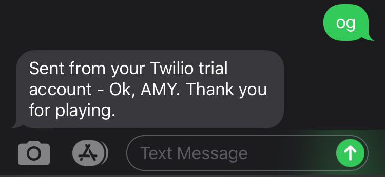
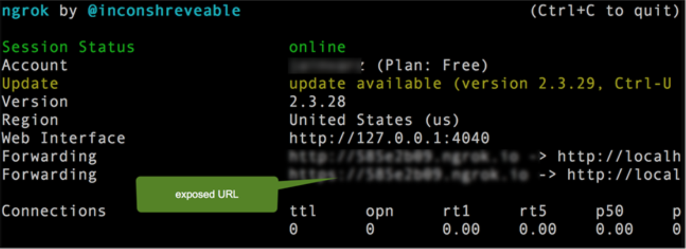
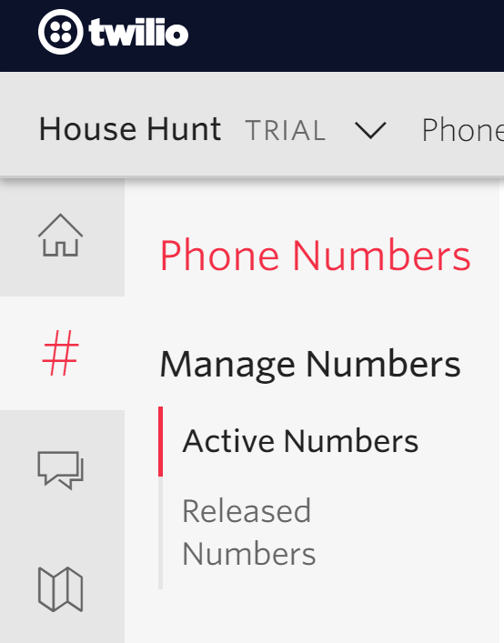
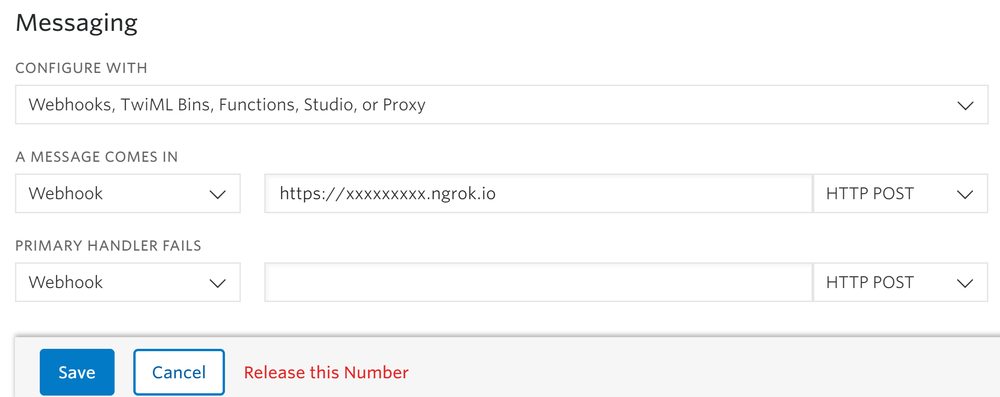

# Welcome to HOUSE HUNT!

HOUSE HUNT is basically like a physical version of the game Scattergories, with a few unique twists. Just like in Scattergories, you will be given a letter and a set of categories and your task will be to come up with something that starts with that letter for each category. The catch? The items you come up with must be physical items around the house and you will have to search for them. Perfect for those quarantined at home :house:!

Another feature that sets this game apart from how Scattergories is normally played (and brings a more modern twist) is that this game requires the use of your cell phone :iphone:. Most parts of the game will be done automatically through texting and taking pictures. 

# Format and Rules

The game will consist of :three: rounds. Each round, you will receive a text with a letter and a list of 5 categories. You must search around the house to find something that fits each category and starts with the letter. Don't worry, I removed some of the harder letters and the categories are fairly broad.

Most of the categories are meant to be like "something related to ___". So, you don't need to find the actual object, it could just be something depicting it or something normally associated with the category. 
> For instance, say the category is "Outdoors". You don't necessarily need to go outdoors to find something. You could find a shirt with a flower :sunflower: on it or a lawn chair from the garage. It just has to be something that has to do with "outdoors".<Br> 

> Another example, if the category was "bugs", you could find an actual bug, a shirt with a bug on it, a toy bug, a mug with a bug on it, a book about bugs, etc... :beetle: <Br>

**NOTE:** I said "normally associated", you cannot just say "well I could take this outdoors so...".

The following are a few unique rules for specific categories. These categories are more like abstract nouns, for which you will think of something that fits the category and starts with the letter, and then find an object that exhibits that characteristic.
- Color - think of a color that starts with the letter, then find an object of that color (object itself need not start with the letter). 
- Adjective - adjective must start with the letter, object you choose that exemplifies the adjective doesn't need to. 
- Occupation - something related to a *specific* occupation, object starts with the letter, not the occupation.<br>
**NOTE:** You can't just say "well there must be a job that uses paper so I'm gonna find a paper". It should be more like "If I was a __, I would use/wear a blank ___."
- Foreign - this can cover multiple things: an item that has a label that it was made in another country, something that has a foreign name (Venetian blinds, chimichanga), something that depicts a scene, people, or language from another country, etc... For this category, either the object or the country that it is associated with can start with the letter.
- For categories like "hot", "cold", "noisy", "wet", "messy", the object must be something that is normally like that or when used as typically intended is supposed to be like that. For instance, you cannot say a "pot" is noisy just because you can bang on it and make noise. Or say tissue paper is noisy because you can crinkle it up. It must be something that is intended to make noise or needs to make noise as part of its function. A washing machine would count, a fan could count, a dog could count. Also, you can't say ice cream is warm because it would be if you left it in the sun. Ice cream is typically eaten cold. Or say that anything could be wet because you could put it in water. 
- Book - name of book, not including "the" or "a"
- For the categories about "long" or "short", this means longer than 1 ft and shorter than 1 ft, respectively. You don't need to measure, rough estimate is fine.
- Technology - modern technology (1900s+), not fork or shoe or pencil :pencil2:
- Expensive - greater than $100 if bought today (well, pre-coronavirus, basically 2010s+). If it was expensive in the 1900s but is cheap today, it does not count, even if you are specifically referring to the old version. However, if you are specifically referring to an old, cheap object that is expensive today that is fine. So if you found a flip phone that cost $50 in the 1990s, you can still use it for "phone" since a phone today is expensive. It's the word, not the object, that must be expensive today. Also, bought today could mean like an artifact or old family heirloom that if you sold today (someone else bought) would be expensive (even if was cheap when originally bought or made in the olden days).
- Ends with letter: the object must end with the letter, does not need to start with it
- For "high" and "low", the object must be above your waist and below your waist, respectively. <br>
**NOTE:** You cannot move objects from their position to recategorize their height.
- Use up and replace - something you typically use up and replace (shampoo, toothpaste, paper towels, etc...)
- In your room - something in YOUR room
- 21st century item - something that did not exist before the 21st century. You can use an iPhone or smartphone if that is the word you use. You cannot use an iPhone for "phone" since the phone was invented before the 21st century. 
- Sweet - I was thinking like candy :lollipop:, but I guess you could use it as "nice", but remember everyone votes so don't make it too far-fetched.

# How to Play
The core functionality of the game uses the Twilio API. <br>
<br>
In order to play, you will need to set up a Twilio account (a free-trial version is fine) and get a phone number. [Help](https://support.twilio.com/hc/en-us/articles/223136107-How-does-Twilio-s-Free-Trial-work-)

Once your Twilio account is set up, take note of your phone number: 1-XXX-XXX-XXXX. This will be the number you send/receive texts from during the game. Give this number to all players. 

To enter the game, *text your name*. 
**NOTE:** This will not start the game yet. You should receive a welcome message with the name you just sent.<br>
<br>

Everyone should agree upon a time limit for the game (ex: 20 minutes). Keeping track of time must be done yourself (set an alarm) :alarm_clock:.

Once everyone has entered the game, everyone can start by *texting "go"*.<br>
<br>
You should receive a text with a letter and list of categories for that round. Let the search begin!

When you find an object, take a picture of it and send it to the number with the following message: "{category#}. word"<br>
For example, if you found an egg for category #1 in the list, text *1. Egg*). <br>
**NOTE:** Send this info in a single text (pic and obj name), NOT send pic then send message.<br>
<br>

After you send your object text, you should receive a confirmation text. Once you have found all 5 objects, you will receive the info for the next round. Once you have completed the last round, you will receive a text telling you that you are done. 
<br>

If you are stuck on a category and would like to move on to the next round anyway, *text "skip"*. This will move you to the next round. <Br>
**NOTE:** Once you move to the next round, you cannot go back to something from a previous round.
 <br>

If, at any time, you would like to stop playing all together, *text "og"* (the opposite of go).
<br>

**NOTE:** You cannot search the internet for ideas or screenshot images of objects.

# Scoring
Just like in Scattergories points are earned for unique responses. Each object that you found that counts will be 1 point. <br>
If multiple players chose the same object (the word for the object, not necessarily the exact same item), those players do not receive points for that category.

At the end of the game, everyone joins together to go through everyone's items on the website part of the game and collectively vote on whether each object counts (must start with letter, fit category, and be unique). Players can give an explanation about a questionable object if necessary. 

The player with the most points wins!

# Things to Note
- The letter and categories should be the same for each player every round for fairness.
- You don't need to find things in the order specified. Just make sure you use the correct category number in your text message.
- You cannot submit multiple objects for the same category
- You cannot be wearing or holding the item (whatever you are wearing at the beginning of the game is not eligible to be submitted)
- The letters and categories are randomly selected, thus you may have the same letter/category pair again (lucky you!)
- You can travel outside as long as stay on your house's property

# How to Run Game
- Clone project from GitHub
```
$ git clone https://github.com/AmyWeitzman/House-Hunt.git
```
- Install requirements.txt
```
$ pip install requirements.txt
```
### Running game
- Start/Connect server
 - [Install ngrok](https://www.softwaretestinghelp.com/ngrok-introduction/)
 - Once you have ngrok running, take note of the exposed url (listed as Forwarding). Should look something like this: https://xxxxxxx.ngrok.io <br>
 <br>
 - Go to your Twilio account. On the phone numbers tab, choose your number.<br>
 <br>
 - Scroll down to messaging. In the "A Message Comes In" section, set the Webhook to that ngrok url. <br>
 <br>
 - Make sure you hit save and you should be all set to go for the game!
### Scoring Website
**NOTE:** only do this after you have finished playing the game<br>
- Run scoring website<br>
**make sure you are in the house-hunt directory**
```
$ npm start
```
